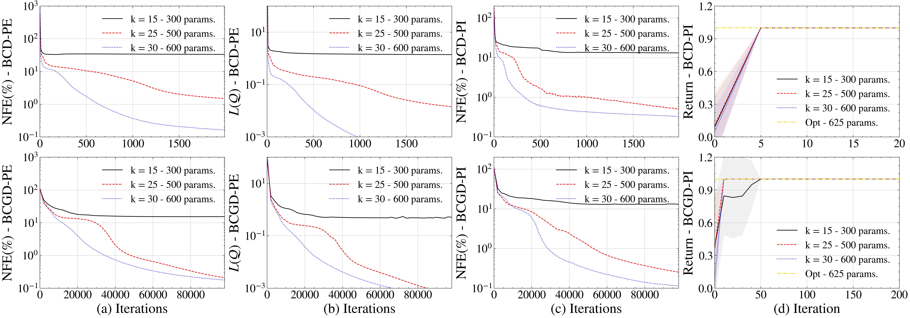

# Addressing Finite-Horizon MDPs via Low-Rank Tensor Value Approximation

by
Sergio Rozada,
Jose Luis Orejuela,
and Antonio G. Marques,

This code belongs to the paper [*Addressing Finite-Horizon MDPs via Low-Rank Tensor Value Approximation*](https://arxiv.org/abs/2501.10598).

## TLDR

> This paper models the non-stationary value functions of finite-horizon Markov Decision Processes as low-rank tensors, reducing their representation and learning costs while retaining competitive performance.

    

## Abstract

> Learning optimal policies in finite-horizon Markov Decision Processes (MDPs) is challenging because value functions and policies change with time. Consequently, the number of values to estimate grows with the state-action space and the time horizon. This paper addresses this issue by collecting the value functions into a tensor and imposing a low-rank PARAFAC structure. We formulate the Bellman equations as a low-rank optimization problem and develop block-coordinate descent and block-coordinate gradient descent algorithms with theoretical convergence guarantees. For unknown system dynamics, we introduce a model-free version that learns the tensor factors from sampled trajectories. Experiments on synthetic and resource-allocation environments show that the proposed methods reduce computational and sample requirements while achieving competitive returns.

## Software implementation

All source code used to generate the results and figures in the paper is in the `src` folder. The calculations and figure generation are all done by running:

* `main.py`: Runs all the experiments, stores the data, and plots the figures.

The experiments include grid world, wireless communications, battery management, channel coding, pendulum, and cart-pole environments. Results generated by the code are saved in `results`, and figures are saved in `figures`.

To reproduce all experiments and figures, run:

    python main.py

## Getting the code

You can download a copy of all the files in this repository by cloning the
[git](https://github.com/sergiorozada12/fhtlr-opt-learning) repository:

    git clone https://github.com/sergiorozada12/fhtlr-opt-learning.git

or [download a zip archive](https://github.com/sergiorozada12/fhtlr-opt-learning/archive/refs/heads/main.zip).

## Dependencies

You'll need a working Python environment to run the code.
The recommended way to set up your environment is through [virtual environments](https://docs.python.org/3/library/venv.html). The required dependencies are specified in the file `requirements.txt`.

    python -m venv venv
    source venv/bin/activate
    pip install -r requirements.txt
